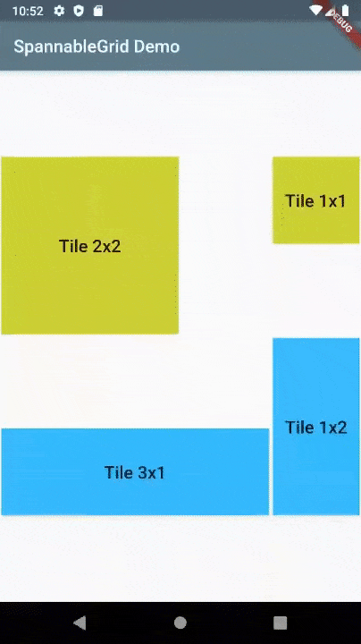

# Spannable Grid
<a href="https://pub.dev/packages/spannable_grid"></a>&nbsp;<a href="./LICENSE"></a>

The **SpannableGrid** is a Flutter widget that allows its cells to span columns
and rows and supports moving cells inside the grid.



## Features

- The widget is sized itself to fit its parent width and/or height
- The number of columns and rows is fixed
- Cells can span columns and rows
- Supports editing mode, in which cells can be moved inside the grid to available places 
- Various editing strategies
- Styling the grid and its cells

## Usage

In the `dependencies:` section of your `pubspec.yaml`, add the following line:

```yaml
dependencies:
  spannable_grid: ^0.3.0
```

Import the package

```dart
import 'package:spannable_grid/spannable_grid.dart';
```

#### Create grid items

The `SpannableGrid` widget requires the list of `SpannableGridCellData` objects that define cells appearance.

```dart
    final cells = <SpannableGridCellData>[];
    cells.add(SpannableGridCellData(
      column: 1,
      row: 1,
      columnSpan: 2,
      rowSpan: 2,
      id: "Test Cell 1",
      child: Container(
        color: Colors.lime,
        child: Center(
          child: Text("Tile 2x2",
            style: Theme.of(context).textTheme.title,
          ),
        ),
      ),
    ));
    cells.add(SpannableGridCellData(
      column: 4,
      row: 1,
      columnSpan: 1,
      rowSpan: 1,
      id: "Test Cell 2",
      child: Container(
        color: Colors.lime,
        child: Center(
          child: Text("Tile 1x1",
            style: Theme.of(context).textTheme.title,
          ),
        ),
      ),
    ));
```  
 
#### Add SpannableGrid widget

```dart
SpannableGrid(
  columns: 4,
  rows: 4,
  cells: cells,
  onCellChanged: (cell) { print('Cell ${cell.id} changed'); },
),
```

#### Editing mode

In the editing mode user can move cells to another empty place withing the grid.

Use `editingStrategy` parameter to define the behaviour in the editing mode.
It has following options:

| Name  | Description |
|---|---|
| `allowed`  | User can move the cells  |
| `enterOnLongTap`  | User should use a long tap on the cell to enter the editing mode  |
| `exitOnTap`  | When finished moving the cell, user should tap the cell to exit the editing mode  |
| `immediate`  | User can move cells immediately, just by starting dragging them  |
| `moveOnlyToNearby`  | The cell can be moved only to nearby empty cells  |

User can enter editing mode by long press on the cell.

In the editing mode the editing cell is highlighted, other cells are faded and the grid structure becomes visible. User can move editing cell to another available place inside the grid. 

The updated cell is returned in `onCellChanged` callback.

#### Styling

Use the `style` parameter to style the appearance of the grid and its cells.

The following options are supported:

| Name  | Description |
|---|---|
| `backgroundColor`  | It is used to display empty cells, when the `emptyCellView` parameter is not specified.  |
| `contentOpacity`  | It is used in the editing mode to make the content cells transparent, so the underlying grid structure becomes visible.  |
| `selectedCellDecoration`  | An additional decoration that is applied to the selected cell to highlight it in the editing mode.  |
| `spacing`  | A space between gird cells.  |

When the `showGrid` parameter is `true` the grid's structure is always visible. Otherwise it appears only in the editing mode.

#### Full example

You can find demo app in the [example](https://github.com/ech89899/spannablegrid-flutter/tree/master/example) project.

## More

#### Changelog

Please check the [Changelog](CHANGELOG.md) page for the latest version and changes.

#### License

Author: Evgeny Cherkasov.

This package is published under [MIT License](LICENSE).

#### Contributions

Feel free to contribute to this project.

[Flutter](https://flutter.dev/docs)